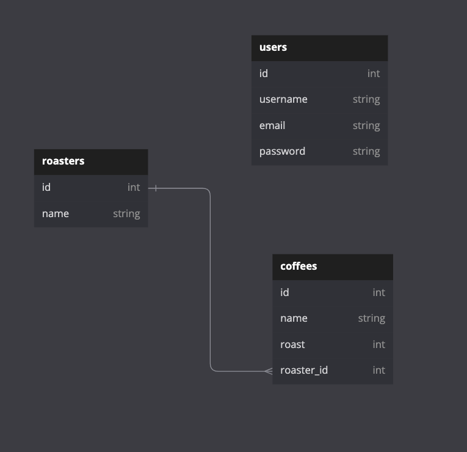

# I-need-my-coffee-fast...api
A Docker-containerized fullstack application with: a RESTFUL FASTApi API, React.js and Bootstrap frontend, PostgreSQL database, and PGAdmin database administration.

Interact with the client at port:3000 URL "/" Home Page:

Featuring full CRUD on a one-to-many entity relationship (Roaster -< Coffee) created by Victor Haynes

Additional Features:
- JWT for authentication & admin-specific actions
- Custom Model validations
- Custom Response Serializers & attributes

To build:
- `$ docker-compose up`

To create databse tables run these commands from the project root after building. This will run the alembic commands for the "api" service (the Python-FastAPI application):
- `$ docker-compose run api alembic revision --autogenerate -m "New Migration"`
- `$ docker-compose run api alembic upgrade head`

Discover this API at port:8000 URL "/docs":

React.js Installations
- Bootstrap `$ npm install react-bootstrap bootstrap`
- React Router `$ npm install react-router-dom@6`